# CRM

CRM is a full-stack customer relationship management application built with React + Vite on the frontend, Node.js + Express on the backend, and MySQL + mysql2 in the database. It provides an internal workspace for managing companies, customers, leads, products, orders, invoices, payments, tasks, reports, notifications, users, and dashboard analytics.

## Features

- JWT-based login for internal users; public registration is disabled.
- Admin-managed user accounts from the Users module.
- Admin-only user creation, editing, activation/deactivation, password reset, and user listing.
- User deletion is disabled; deactivation is used instead.
- Inactive users cannot log in, and inactive users with old tokens cannot access protected routes.
- Admin and Employee role-based access with scoped CRM data ownership.
- Admins see and manage the full CRM dataset.
- Employees see only their scoped records.
- Companies are scoped by `created_by`.
- Customers and leads are scoped by `created_by` or `assigned_to`.
- Orders are scoped by creator or owned/assigned customer.
- Invoices and payments are scoped through issued orders and customers.
- Tasks are scoped by `created_by` or `assigned_to`.
- Admin-only product management; Employees can view or select active products.
- Dashboard and reports show global Admin data or Employee "My" scoped data.
- Notifications center, invoice export, and invoice printing.
- Responsive SaaS-style UI with compact dashboard and table interactions.

## Current Access Model

- Public registration is disabled. `/register` redirects to `/login`, `/api/auth/register` returns `403`, and the UI does not expose a Register/Create Account flow.
- User accounts are created by administrators from the Users module.
- Admins can list, create, edit, activate/deactivate, and reset passwords for users.
- `/api/users` is Admin-only.
- `/api/users/assignees` returns active assignable users for authenticated users.
- Customers are CRM records only; they are not login users.
- No Gmail, SMS, WhatsApp, or customer portal integration exists in the current application.

## Screenshots

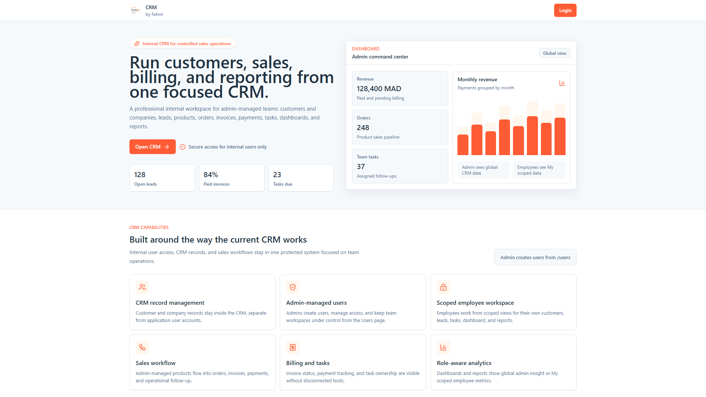
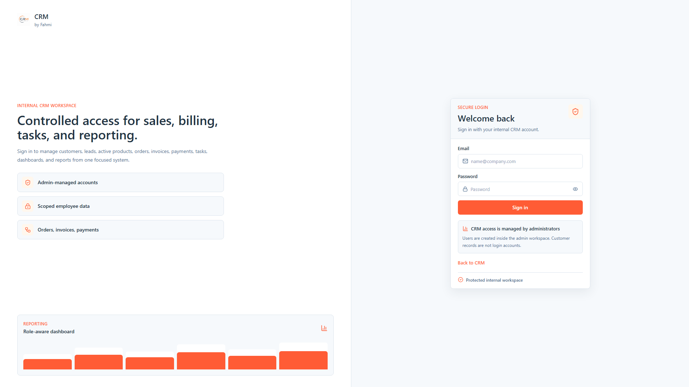
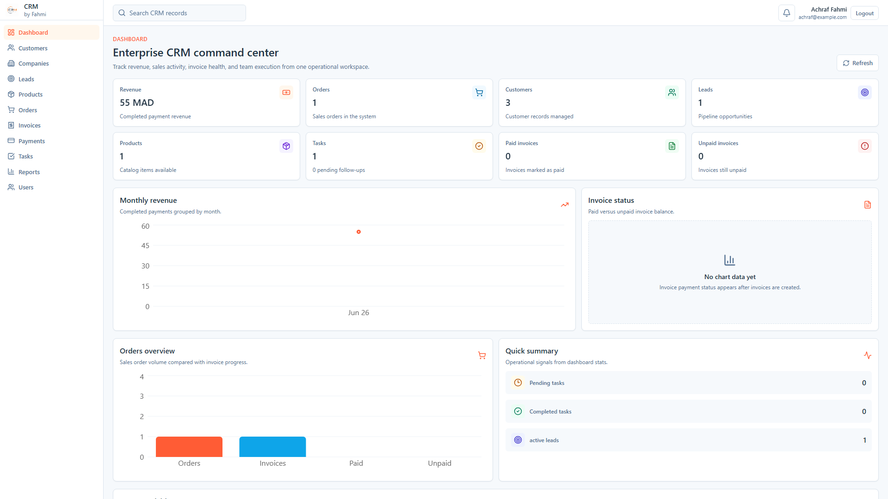
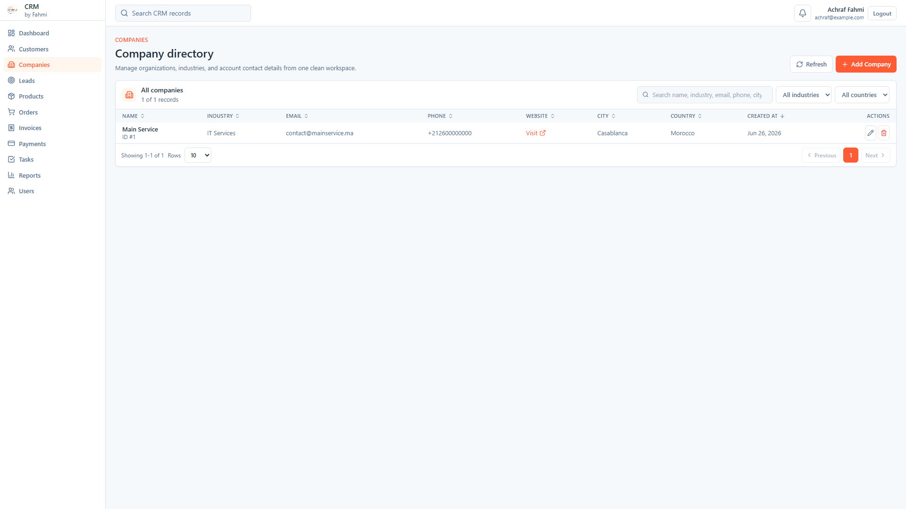
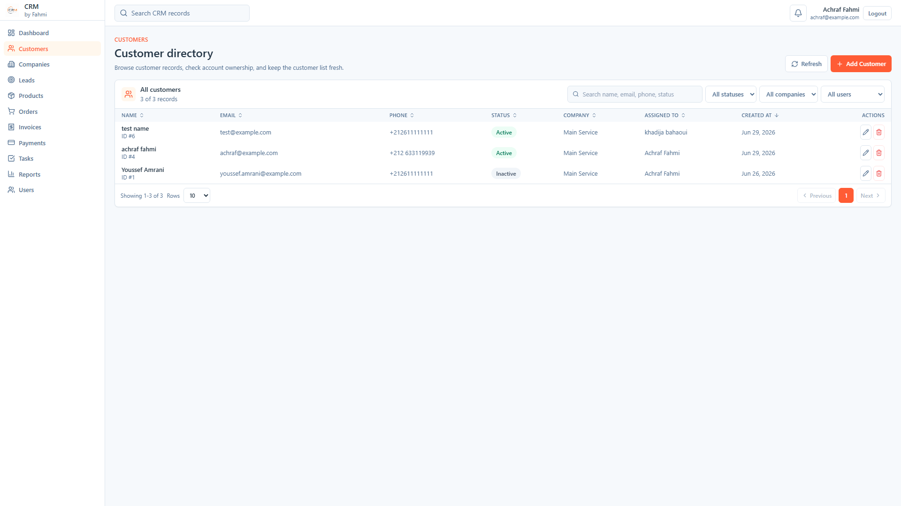
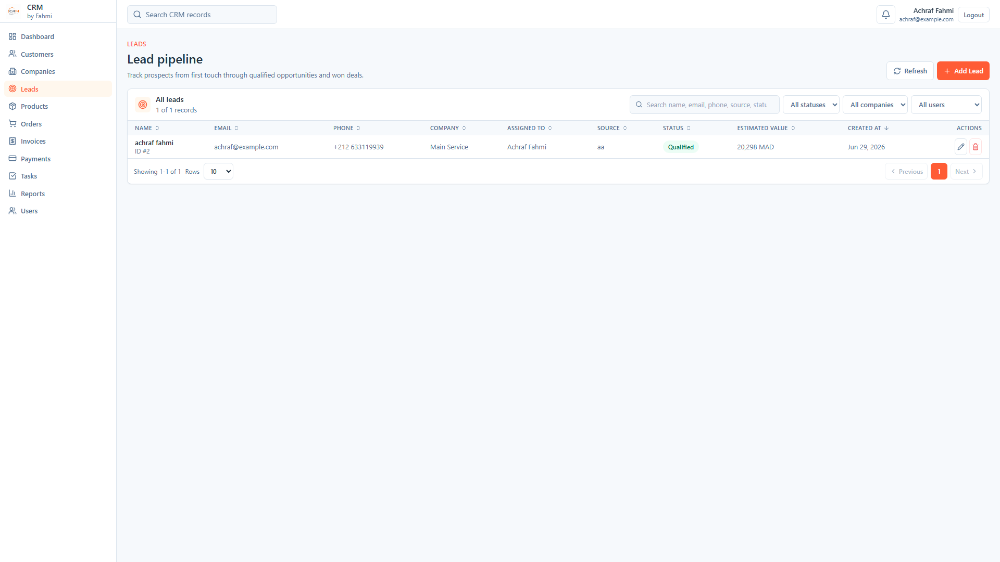
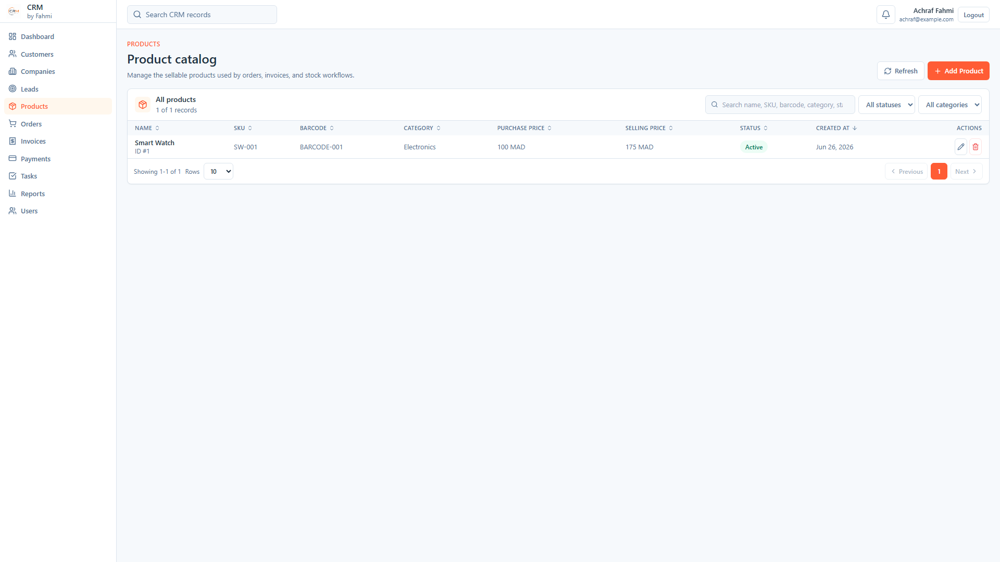
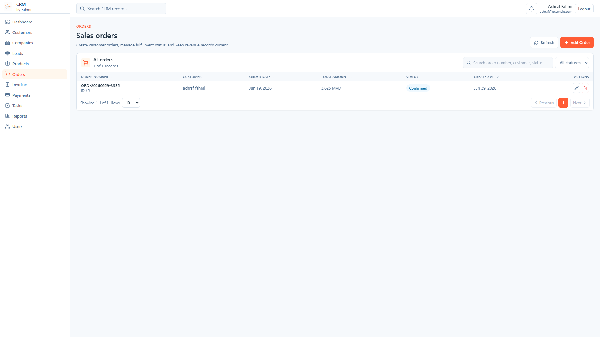
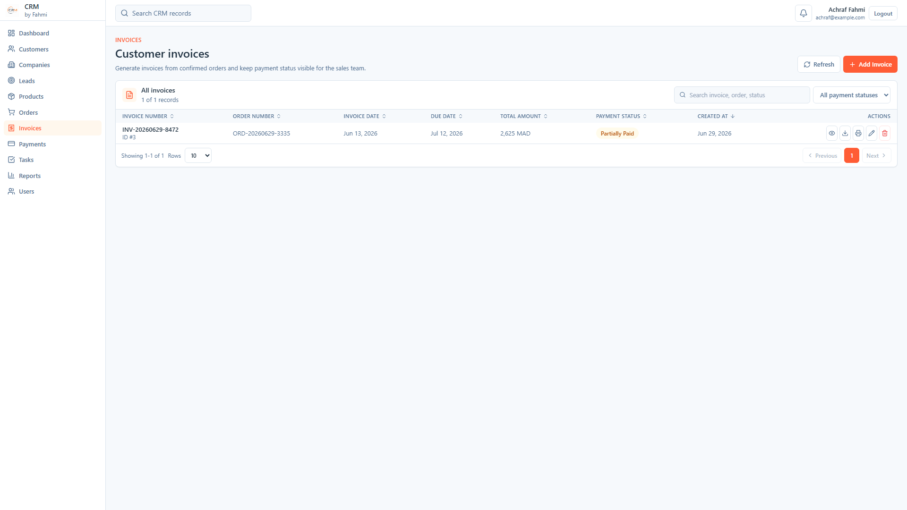
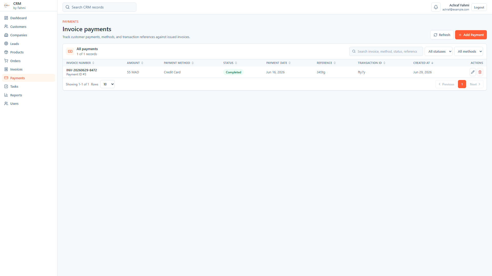
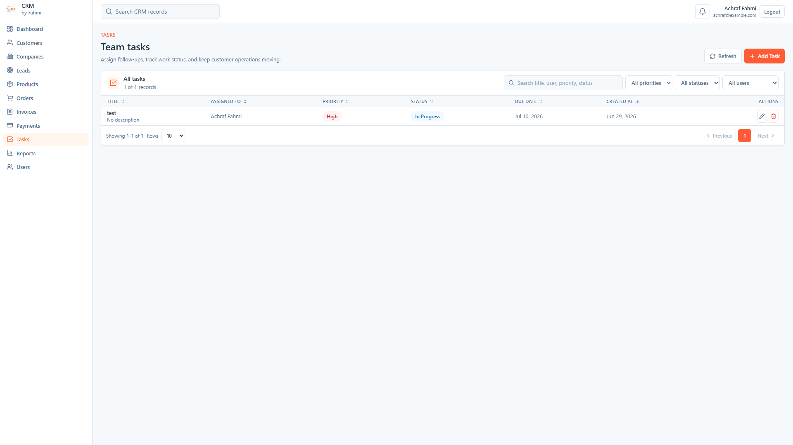
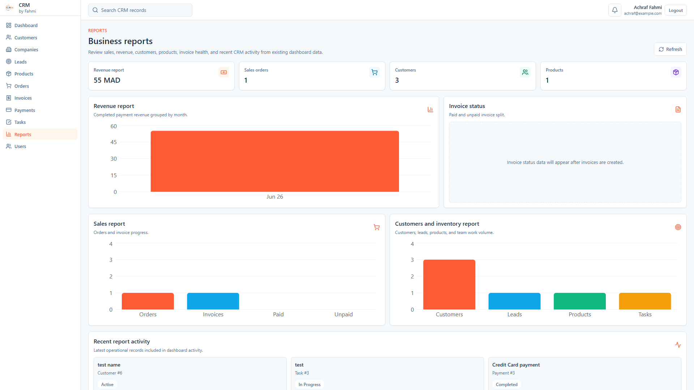
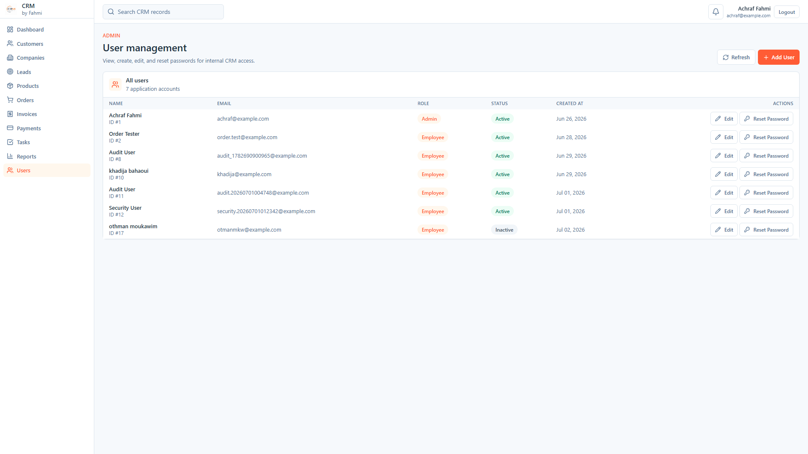
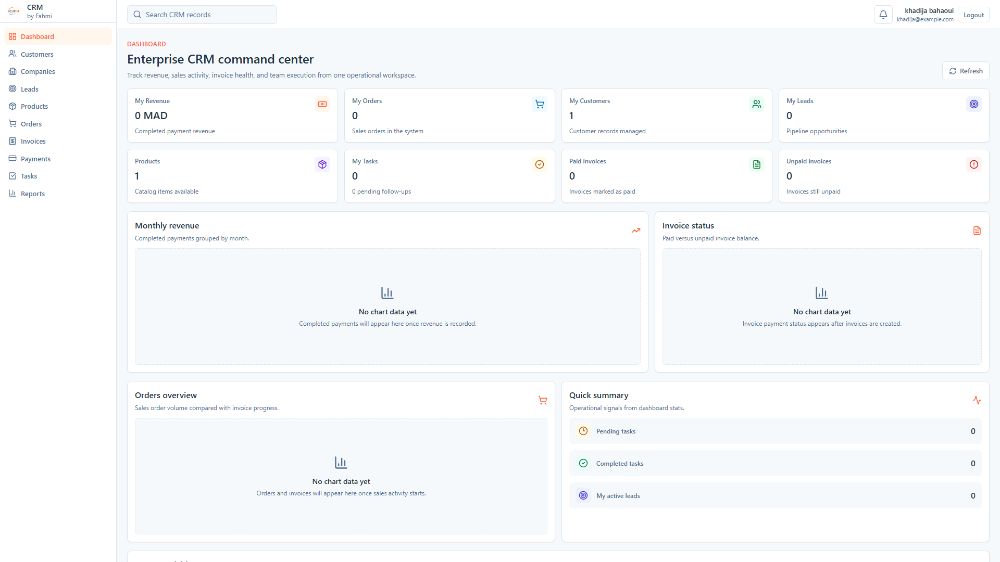
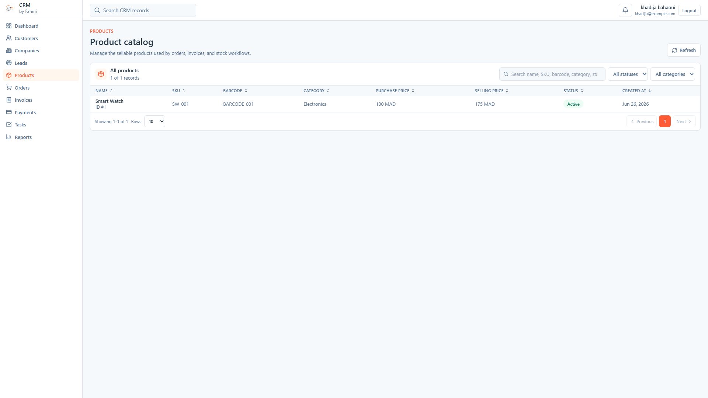
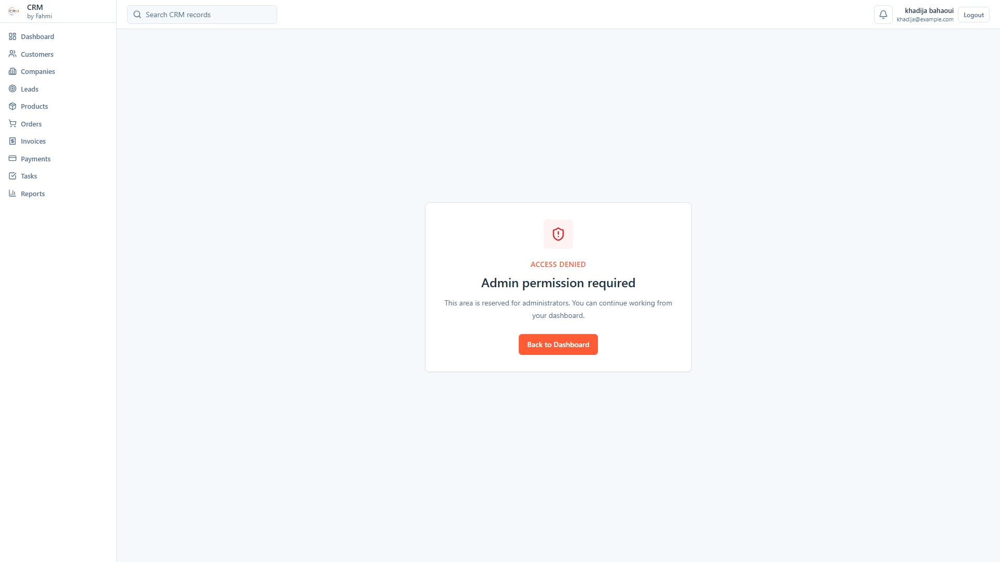

## Tech Stack

Frontend:

- React
- Vite
- Tailwind CSS
- React Router
- Axios
- Recharts
- Lucide React
- React Hot Toast

Backend:

- Node.js
- Express.js
- MySQL + mysql2
- JWT
- bcrypt
- Service-layer backend architecture

## Project Structure

```text
.
|-- client/
|   |-- public/
|   |   `-- images/
|   |-- src/
|   |   |-- api/
|   |   |-- components/
|   |   |-- context/
|   |   |-- hooks/
|   |   |-- layouts/
|   |   |-- pages/
|   |   |-- routes/
|   |   |-- utils/
|   |   |-- App.jsx
|   |   |-- index.css
|   |   `-- main.jsx
|   |-- index.html
|   |-- package.json
|   |-- postcss.config.js
|   |-- tailwind.config.js
|   `-- vite.config.js
|-- docs/
|-- screenshots/
|-- server/
|   |-- src/
|   |   |-- config/
|   |   |-- controllers/
|   |   |-- database/
|   |   |   `-- schema.sql
|   |   |-- middleware/
|   |   |-- models/
|   |   |-- routes/
|   |   |-- services/
|   |   |-- utils/
|   |   |-- validations/
|   |   |-- app.js
|   |   `-- server.js
|   `-- package.json
|-- .gitignore
|-- LICENSE
`-- README.md
```

## Installation

### Backend

```bash
cd server
npm install
npm run dev
```

The backend runs from `server/src/server.js` and exposes the API under `/api`.

### Frontend

```bash
cd client
npm install
npm run dev
```

The frontend is a Vite React app.

### Database

1. Open phpMyAdmin.
2. Import the schema file:

```text
server/src/database/schema.sql
```

The schema creates the `crm_pro` database when imported unchanged.

3. Update the backend `.env` file with your MySQL connection values.

## Environment Variables

The backend reads environment variables from `server/.env` through `dotenv`.

```env
PORT=5000
NODE_ENV=development
JWT_SECRET=your_jwt_secret
JWT_EXPIRES_IN=1d
DB_HOST=127.0.0.1
DB_PORT=3306
DB_DATABASE=crm_pro
DB_USER=root
DB_PASSWORD=
DB_CONNECTION_LIMIT=10
```

Notes:

- `PORT` defaults to `5000` if not set.
- `JWT_SECRET` has a development fallback, but a real secret should be set locally.
- `DB_DATABASE` defaults to `crm_pro`, matching `server/src/database/schema.sql`.
- The frontend API client defaults to `http://localhost:5000/api`. Set `VITE_API_URL` in the frontend environment to override it.
- If MySQL is unavailable when the backend starts, the backend logs the connection target and retries until MySQL becomes available.

## API Overview

Implemented API route groups:

- `GET /api/health`
- `/api/auth` - login, current user, and disabled public registration.
- `/api/users` - Admin-only user management, password reset, activation/deactivation, and user listing.
- `/api/users/assignees` - active assignable users for authenticated CRM users.
- `/api/companies` - company CRUD with scoped ownership.
- `/api/customers` - customer CRUD with `created_by` and `assigned_to` scope rules.
- `/api/contacts` - contact CRUD.
- `/api/leads` - lead CRUD with ownership and assignment rules.
- `/api/categories` - category CRUD.
- `/api/products` - product CRUD with Admin-only writes and active-product read access for Employees.
- `/api/inventory` - inventory CRUD.
- `/api/orders` - order CRUD with scoped access.
- `/api/invoices` - invoice CRUD with scoped access.
- `/api/payments` - payment CRUD with scoped access.
- `/api/tasks` - task CRUD with assignment support.
- `/api/notifications` - notifications, unread count, read actions, delete.
- `/api/dashboard` - scoped stats, revenue, recent activities.

Most CRM routes are protected by authentication middleware and require a Bearer token. Public registration is intentionally disabled; administrators create user accounts from the Users module.

## Frontend Pages

- Landing page
- Login
- Dashboard
- Companies
- Customers
- Leads
- Products
- Orders
- Invoices
- Payments
- Tasks
- Reports
- Users (Admin only)
- Access Denied

## UI Features

- Responsive design for desktop, tablet, and mobile.
- Sticky dashboard sidebar on desktop.
- Global search in the dashboard topbar.
- Notification center in the dashboard topbar.
- KPI cards and charts with Recharts.
- Data tables with pagination, sorting, filters, search, loading states, empty states, and error states.
- Invoice PDF export.
- Invoice printing.
- Professional modal forms.
- Accessible icon buttons and focus states.

## Development Checks

Frontend:

```bash
cd client
npm run lint
npm run build
```

Backend load check:

```bash
cd server
node -e "require('./src/app'); console.log('backend app loaded')"
```

## Author

**Achraf Fahmi**

GitHub:  
https://github.com/achraffahmi26-rgb

LinkedIn:  
https://www.linkedin.com/in/achraf-fahmi-009781311/

## License

MIT
